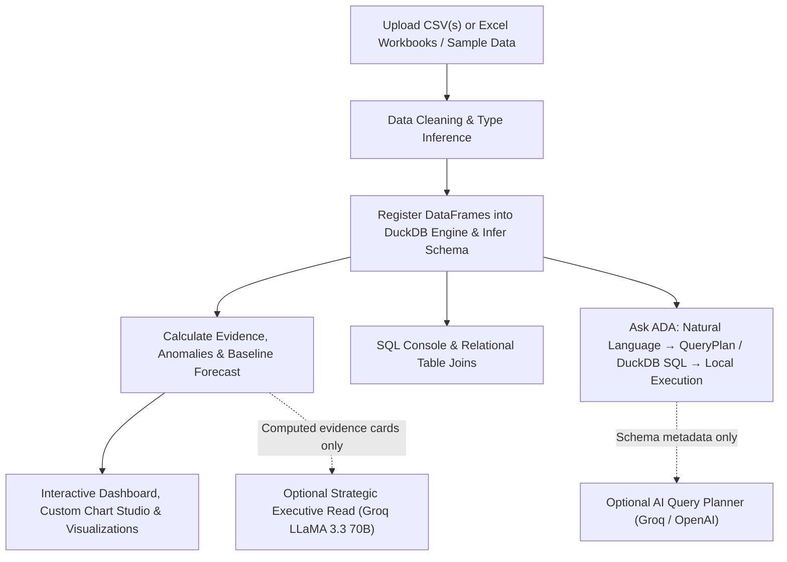

# Automated Data Analyst (ADA) — AI-Powered Data Analyst

[](https://www.python.org/)
[](https://streamlit.io/)
[](https://duckdb.org/)
[](https://groq.com/)
[](LICENSE)
[](https://port-folio-main-window.vercel.app/)

> Developed by **Kartikeya Mishra** | [Portfolio](https://port-folio-main-window.vercel.app/)

ADA is a production-ready, privacy-conscious **AI-powered Data Analyst** built with Python, Streamlit, DuckDB, Pandas, and Plotly. Upload single or multiple CSV / Excel files, interact with your data in natural language, generate business insights, execute live SQL queries, perform anomaly detection, and view guarded forecasts.

---

## 🖼️ Application Preview & Live UI


---

## 🌟 Key Features & Tabs

* 📁 **Multi-CSV & Relational Data Ingestion**: Upload one or more CSV / Excel files simultaneously. Tables are registered in an in-memory **DuckDB** relational database for cross-table joins.
* 💬 **Natural Language Querying (Ask ADA)**: Plain-English questions mapped to deterministic Pandas query plans and SQL code executed locally.
* ⚡ **SQL Code Generation & Execution Console**: View and copy generated SQL code (`SELECT`, `GROUP BY`, `ORDER BY`, `JOIN`) or run custom ANSI SQL queries in the live interactive SQL console.
* 🔍 **Anomaly Detection Engine**: Outlier detection (z-score / IQR / Isolation Forest) with clear natural language evidence explanations.
* 📈 **Guarded Baseline Forecasting**: Time-series forecasting with month-of-year seasonality, uncertainty bands, and backtested error margins.
* 📊 **Interactive Plotly Visualizations & Custom Chart Studio**: Generate Bar, Line, Pie, Scatter, and Boxplot charts dynamically.
* 🤖 **Groq LLaMA 3.3 70B Strategic Synthesis**: Fast AI-driven executive summaries, prioritized action cards, and watchout analysis.
* 🎛️ **1-Click Pre-Loaded Sample Datasets**: Instantly try the app with 3 pre-configured sample datasets (E-Commerce Multi-CSV, SaaS Subscriptions, HR Analytics).
* 🔒 **Privacy & Deterministic Core**: Calculations run locally on your machine. Optional AI features receive schema metadata and computed evidence—**never raw uploaded data rows**.
* 🐳 **Docker Containerization**: Production-ready `Dockerfile` and `docker-compose.yml` for 1-command startup.

---

## 💡 Example Questions & Queries

### 1. Conversational Analyst Questions (Ask ADA Tab)
- *"Which region generated the highest revenue?"*
- *"Show monthly sales trends."*
- *"Which products are underperforming?"*
- *"What are the top five customers?"*
- *"What is the total revenue by product?"*
- *"Detect anomalies in the dataset."*

### 2. Relational SQL Queries (SQL Console & Code Tab)
```sql
-- Relational JOIN query across Sales and Customer tables
SELECT 
    s."Order ID", 
    s.Product, 
    s.Region, 
    s.Revenue, 
    c.Tier, 
    c."Segment Type"
FROM sales s
JOIN customers c ON s."Customer ID" = c."Customer ID"
ORDER BY s.Revenue DESC
LIMIT 10;
```

```sql
-- Monthly revenue aggregation with DuckDB
SELECT 
    Product, 
    DATE_TRUNC('month', "Order Date") AS period, 
    SUM(Revenue) AS total_revenue
FROM data_table
GROUP BY Product, period
ORDER BY total_revenue DESC;
```

---

## 🏗️ System Architecture



---

## 💻 Tech Stack

- **Frontend / UI**: Streamlit 1.59, Custom CSS, Plotly Interactive Visualizations
- **Relational SQL Engine**: DuckDB
- **Data Analytics Core**: Pandas, NumPy, Scikit-Learn, SciPy
- **LLM Integration**: Groq API (LLaMA 3.3 70B) / OpenAI / Gemini compatible structured output planning
- **Containerization**: Docker & Docker Compose

---

## 🚀 Quick Start & Local Execution

### Option 1: Running with Python Virtual Environment

```bash
# 1. Clone repository
git clone https://github.com/Kartikeyam2007/AADA.git
cd AADA

# 2. Create and activate virtual environment
python -m venv .venv
source .venv/bin/activate  # On Windows: .venv\Scripts\activate

# 3. Install dependencies
pip install -r requirements.txt

# 4. Run application
streamlit run app.py
```

Open `http://localhost:8501` in your browser.

---

### Option 2: Running with Docker Compose

```bash
docker-compose up --build
```

Open `http://localhost:8501` in your browser.

---

## 📋 Assumptions & Implementation Notes

1. **Privacy-First Design**: The application executes 100% of calculations, SQL queries, and code locally. No raw rows or cell values are ever transmitted over the network.
2. **DuckDB Engine**: DuckDB is leveraged for lightning-fast ANSI SQL query execution across multiple uploaded CSV files.
3. **Deterministic Core with Optional LLM**: Core analytics, anomaly detection, and natural language query execution run via rule-based deterministic parsers. An optional Groq or OpenAI API key can be provided for complex natural language questions and strategic synthesis.

---

## 🧪 Testing

Run the full automated unit test suite:

```bash
python -m unittest discover -s tests -v
```

---

## 📄 License & Author

- **Author**: Kartikeya Mishra
- **Portfolio**: [https://port-folio-main-window.vercel.app/](https://port-folio-main-window.vercel.app/)
- **License**: [MIT License](LICENSE)
