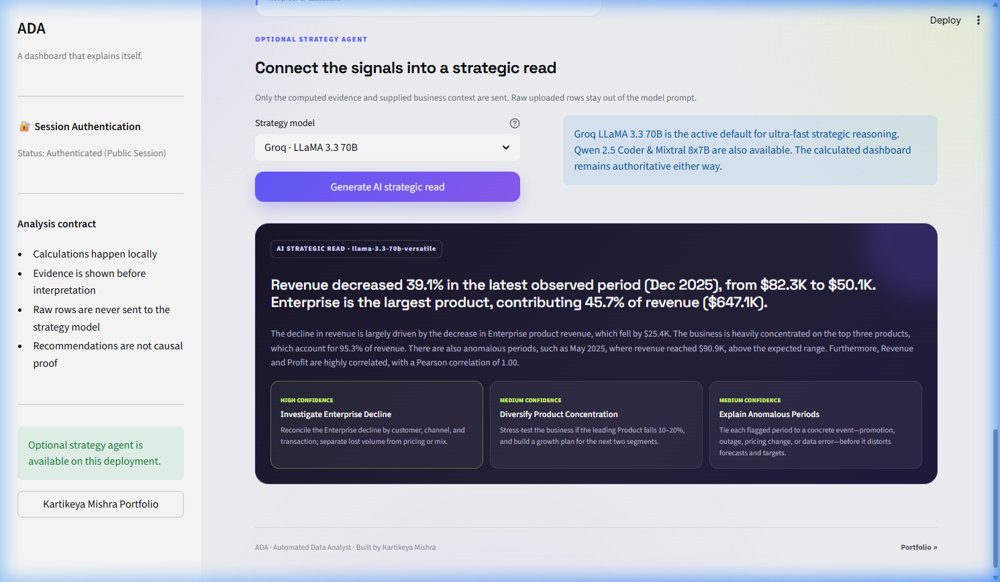
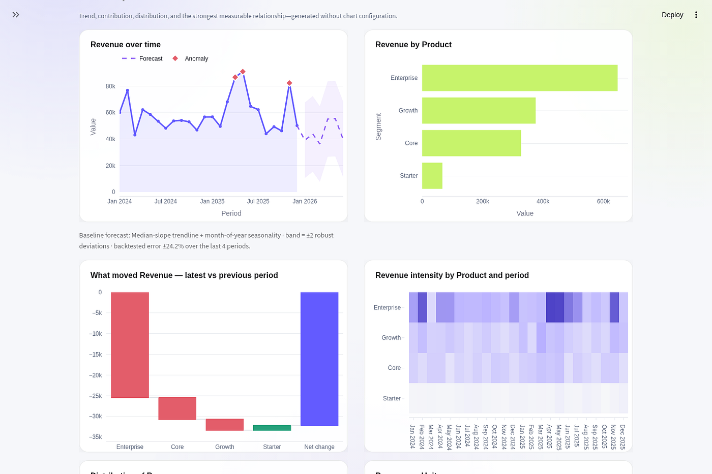
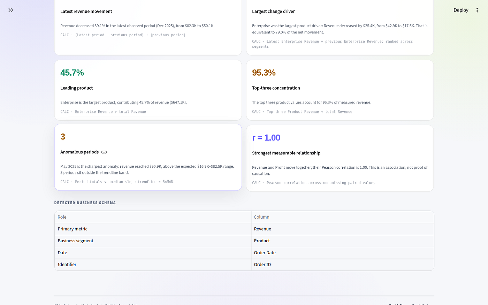
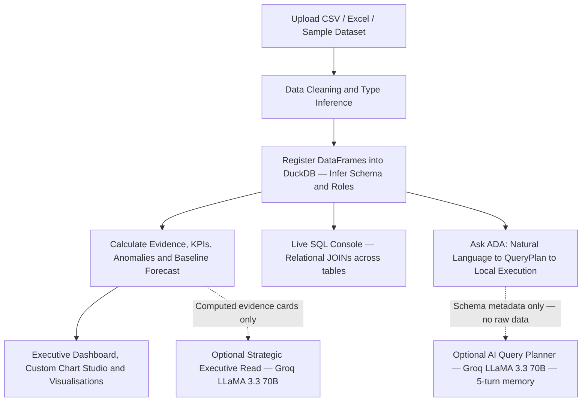

# ADA — Automated Data Analyst

[](https://www.python.org/)
[](https://streamlit.io/)
[](https://duckdb.org/)
[](https://groq.com/)
[](https://automated-data-analyst-ada.streamlit.app/)
[](https://github.com/KartikeyaM2007/AADA/tree/main/tests)
[](LICENSE)
[](https://port-folio-main-window.vercel.app/)

> **Author:** Kartikeya Mishra &nbsp;|&nbsp; **Live App:** [automated-data-analyst-ada.streamlit.app](https://automated-data-analyst-ada.streamlit.app/) &nbsp;|&nbsp; **Portfolio:** [port-folio-main-window.vercel.app](https://port-folio-main-window.vercel.app/)

---

ADA is a production-ready AI-powered data analyst. Upload a CSV or Excel file — or use one of the 10 included sample datasets — and immediately get an executive dashboard, natural language Q&A, anomaly detection, time-series forecasting, and a live SQL console. Every calculation is executed locally and fully auditable; the LLM only ever sees schema metadata, never raw row values.

---

## Live Application

**[https://automated-data-analyst-ada.streamlit.app/](https://automated-data-analyst-ada.streamlit.app/)**

No installation required. The live app is pre-loaded with sample datasets so you can test every feature in under a minute.

---

## Application Preview



| Ask ADA — Natural Language Q&A | Anomaly Detection + Forecasting |
|---|---|
|  |  |

| Drill-Down Analysis | Evidence Ledger |
|---|---|
|  |  |

---

## What ADA Does

### Core Features

| Feature | Detail |
|---|---|
| **Natural Language Q&A** | Ask anything in plain English. Questions are parsed into deterministic `QueryPlan` objects and executed locally via Pandas. Every answer exposes its exact calculation. |
| **Pie, Bar, Line, Scatter Charts** | Chart type is inferred from the question text. Proportion or share language renders a donut pie. Correlation or versus language renders a scatter with OLS trendline. Trend questions render area charts. |
| **SQL Code Generation + Console** | Every answer generates its equivalent DuckDB SQL. A live console accepts arbitrary ANSI SQL, including cross-table JOINs across uploaded files. |
| **Anomaly Detection** | Z-score, IQR, and Isolation Forest methods with natural language evidence cards explaining why each point was flagged and what action to consider. |
| **Time-Series Forecasting** | Seasonality-aware baseline forecast with uncertainty bands and backtested error margins. Short histories are refused gracefully. |
| **Multi-file Relational Analysis** | Upload multiple CSV or Excel files simultaneously. All tables are registered in an in-memory DuckDB instance for cross-table JOIN queries. |
| **Business Intelligence Brief** | Auto-generated executive summary, KPI cards, trend analysis, and prioritised action recommendations — all calculated locally. |
| **Multi-turn Conversation Memory** | The last 5 chat turns are forwarded to the AI planner as context so follow-up questions like "now show that by region" resolve correctly. |
| **Privacy-First Architecture** | Calculations run entirely in-process. The optional LLM receives only column names and data types — never cell values, never raw rows. |

### Bonus Features

| Feature | Detail |
|---|---|
| Docker containerisation | `Dockerfile` and `docker-compose.yml` for one-command local deployment |
| 10 sample datasets | Covering 10 different industries, included in `/data/` |
| 83 automated unit tests | Covering NLQ engine, anomaly detection, forecasting, SQL engine, and app smoke tests |
| AI agent connection badge | One-click live API status test in the sidebar |
| Table export | CSV download available on every result table |

---

## Sample Datasets

All 10 datasets are in `/data/` and available as one-click preloads inside the app.

| File | Domain | Rows | Primary Metric |
|---|---|---|---|
| `01_e_commerce_sales.csv` | E-Commerce | 500 | Revenue |
| `02_saas_subscriptions.csv` | SaaS / Subscriptions | 400 | MRR |
| `03_hr_employee_analytics.csv` | Human Resources | 350 | Base Salary |
| `04_healthcare_patient_billing.csv` | Healthcare | 450 | Total Billed Amount |
| `05_financial_portfolio.csv` | Finance / Trading | 400 | Investment Amount |
| `06_logistics_shipping_delays.csv` | Logistics | 500 | Shipping Cost |
| `07_digital_marketing_campaigns.csv` | Marketing | 365 | Ad Spend |
| `08_retail_inventory_stock.csv` | Retail | 450 | Stock On Hand |
| `09_hotel_bookings_revenue.csv` | Hospitality | 400 | Nightly Rate |
| `10_customer_support_tickets.csv` | Customer Support | 500 | Resolution Time (hrs) |

---

## Example Questions

The following are answered deterministically — no API key required:

```
Which region generated the highest revenue?
Show monthly sales trends.
Which products are underperforming?
What are the top 5 customers by revenue?
Revenue share by channel.
Revenue vs profit.
Detect anomalies in the dataset.
What grew fastest last quarter?
```

The following require the Groq AI planner (API key in sidebar):

```
Compare this year's performance to last year broken down by product.
Which campaigns had the best ROI relative to impressions?
Now show that by region.
```

---

## System Architecture



The deterministic rule engine handles the majority of questions with zero latency and zero API cost. The LLM is invoked only when the rule engine returns no result. Even then, the LLM outputs a typed `QueryPlan` JSON that is executed locally — it never computes the answer itself.

---

## Tech Stack

| Layer | Technology |
|---|---|
| UI and Serving | Streamlit 1.59, Custom CSS, Plotly |
| Query Engine | Pandas, DuckDB (ANSI SQL) |
| NL Parser | Custom deterministic rule engine (`nlq.py`) |
| AI Planner | Groq API — LLaMA 3.3 70B via OpenAI-compatible client |
| ML and Statistics | Scikit-Learn (Isolation Forest), SciPy, NumPy, Statsmodels |
| Containerisation | Docker, Docker Compose |

---

## Quick Start

### Option 1 — Python Virtual Environment

```bash
git clone https://github.com/KartikeyaM2007/AADA.git
cd AADA

python -m venv .venv
# Windows:
.venv\Scripts\activate
# macOS / Linux:
source .venv/bin/activate

pip install -r requirements.txt
streamlit run app.py
```

Open [http://localhost:8501](http://localhost:8501).

### Option 2 — Docker Compose

```bash
git clone https://github.com/KartikeyaM2007/AADA.git
cd AADA
docker-compose up --build
```

Open [http://localhost:8501](http://localhost:8501).

### Groq API Key (optional)

Add your [Groq API key](https://console.groq.com/) in the sidebar to enable AI-planned queries and the strategic executive read. The application is fully functional without it.

---

## Running Tests

```bash
python -m pytest tests/ -v
```

83 tests across 9 modules: NLQ engine, anomaly detection, forecasting, business intelligence, SQL engine, file parsing, pipeline, AI insights, and full app smoke tests.

---

## Project Structure

```
.
├── app.py                  # Streamlit entry point and page routing
├── nlq.py                  # Deterministic NL query parser and executor
├── ai_insights.py          # AI query planner (Groq / OpenAI)
├── business_insights.py    # KPI, trend, driver and brief generation
├── anomalies.py            # Anomaly detection engine
├── forecasting.py          # Time-series baseline forecast
├── pipeline.py             # Data ingestion, cleaning and schema detection
├── sql_engine.py           # DuckDB SQL generation and execution
├── ui.py                   # Streamlit UI components
├── file_io.py              # CSV / Excel parsing
├── demo_data.py            # Sample dataset generator
├── data/                   # 10 included sample datasets
├── tests/                  # 83 automated unit tests
├── assets/                 # CSS, screenshots, social preview
├── Dockerfile
├── docker-compose.yml
└── requirements.txt
```

---

## Assumptions and Implementation Notes

1. **Deterministic core, optional AI.** All calculations, SQL generation, anomaly detection, and forecasting execute locally. The LLM outputs a structured plan — it never computes a number directly.
2. **Privacy boundary.** The AI planner receives a JSON schema of column names and types plus the user's question. No row values or cell contents leave the process.
3. **Multi-turn memory.** The last 5 conversation turns are forwarded to the AI planner as user and assistant message pairs, enabling coherent follow-up questions within a session.
4. **Chart selection.** Chart type is determined from the question text. Proportion, share, or distribution language triggers a donut chart. Correlation, versus, or compare language triggers a scatter chart with OLS trendline. Time-based questions trigger an area chart. All other questions use a horizontal bar chart.
5. **DuckDB SQL.** Every NLQ answer also generates equivalent DuckDB SQL visible in the "AI Reasoning and Generated SQL" expander, so users can verify and extend any query.

---

## License and Author

- **Author:** Kartikeya Mishra
- **Portfolio:** [port-folio-main-window.vercel.app](https://port-folio-main-window.vercel.app/)
- **License:** [MIT](LICENSE)
